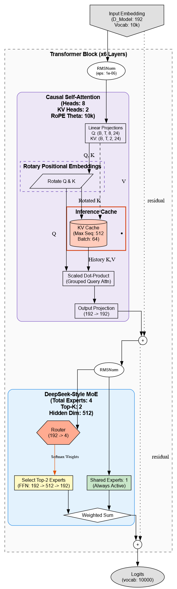
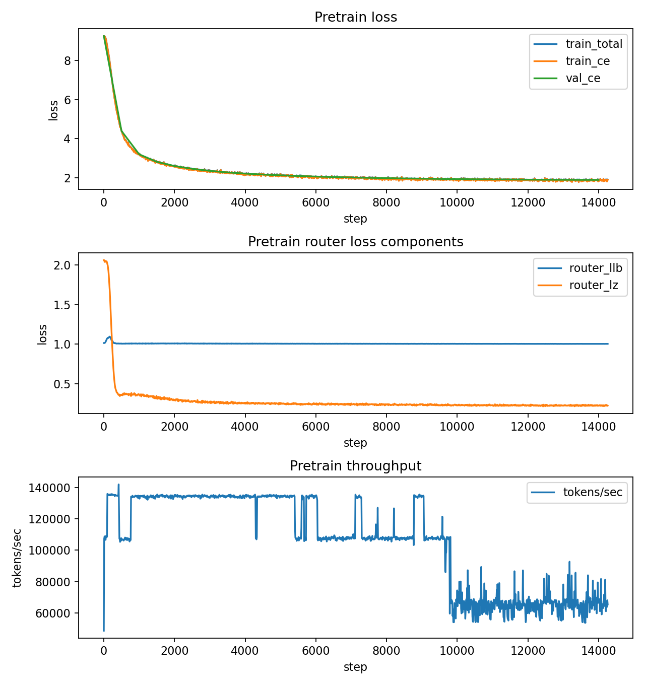
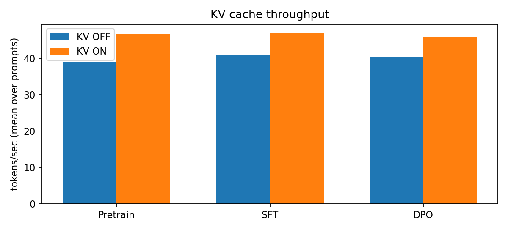
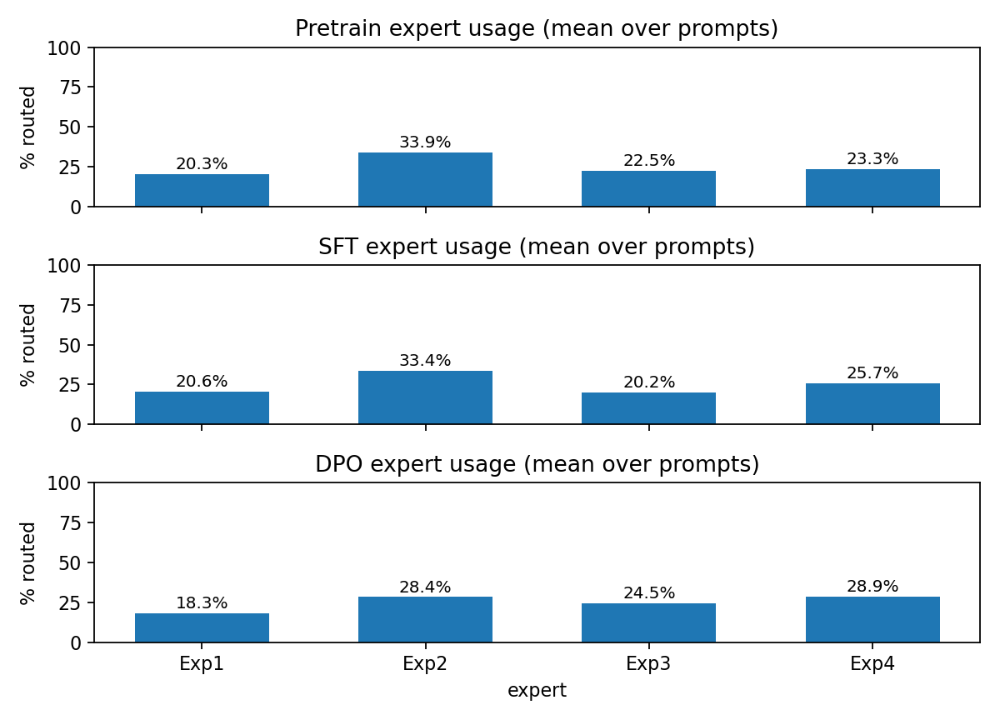

# Nano-MoE (from scratch)

A minimal Mixture-of-Experts (MoE) Transformer implemented from scratch in PyTorch, trained on a small slice of TinyStories (250k train stories), then fine-tuned with synthetic instruction data (SFT) and preference data (DPO). The primary goal of this project is the end-to-end implementation: tokenizer → data pipeline → MoE Transformer → pretraining → SFT → DPO → interactive demo app.

> Note on quality: the model is small (~11M params) and the training setup is intentionally lightweight (limited compute, limited token budget, and a small instruction/preference dataset generated via an external LLM API). In this regime, it is normal to see issues like repetition and weaker instruction-following: small models have less capacity, short pretraining under-exposes them to long-range patterns, and SFT/DPO can overfit or shift behavior when the synthetic datasets are small and narrow. The app and plots are included to make these tradeoffs visible (routing behavior, KV-cache impact, and checkpoint-to-checkpoint differences).

---

## Demo (Streamlit)

The Streamlit app supports:
- **Screen 1**: chat-style generation with checkpoint selection and KV-cache toggle, plus a quick KV throughput benchmark.
- **Screen 2**: last-layer MoE routing inspection for generated tokens (top-k experts + weights, expert usage summary).

Run:
```bash
streamlit run src/streamlit_app/app.py
```
---

## Architecture

This repository implements a small decoder-only Transformer with:

* **RMSNorm**
* **RoPE** positional embeddings
* **Multi-Query Attention** (`n_kv_heads < n_heads`)
* **MoE MLP** (top-k routing) + optional shared experts
* **KV-cache** for fast autoregressive decoding

**Key config (default):**

* `d_model=192`, `n_layers=6`, `n_heads=8`, `n_kv_heads=2`
* `num_experts=4`, `num_shared_experts=1`, `top_k=2`
* `max_seq_len=512`, `vocab_size=10_000`

**Where to put `architecture.png`:**
Place it at the repo root (or inside `assets/`) and include it here:



---

## Results and Plots

Generated figures are written to:

* `reports/figs/`

Include them in the README as follows (after you generate them):

### Pretraining



### Inference / Routing Diagnostics (aggregated over prompts)




To generate plots:

```bash
python scripts/make_plots.py
```
---

## Project Pipeline

### 1) Tokenizer (BPE)

* Train a BPE tokenizer on a small TinyStories text subset (10k train stories).
* Output: `tokenizer.json`

Script:

* `tokenizer.py`

### 2) Data preprocessing (memmapped token stream)

* Download TinyStories and write encoded tokens to flat binary files:

  * `data/shards/train.bin`
  * `data/shards/val.bin`
* Also writes `data/shards/meta.json` (special token IDs, counts, file names).

Script:

* `prepare_data.py`

### 3) Model implementation (core)

* End-to-end implementation of the architecture in `src/model.py`:

  * RoPE and GQA attention with optional KV-cache
  * MoE layer with a shared expert and top-k routing (k=2)
  * Transformer stack + tied embeddings

Core files:

* `src/model.py`
* `src/config.py`

### 4) Pretraining

* Pretrain on the preprocessed TinyStories token stream.
* Produces training logs and checkpoints.

Script:

* `pretrain.py`

Artifacts (expected structure):

* `artifacts/pretraining/ckpt_best.pt`
* `artifacts/pretraining/train_log.jsonl`
* `artifacts/pretraining/val_log.jsonl`

### 5) Synthetic instruction data (SFT)

* Create prompt seeds with constraints (protagonist/theme/required phrases/banned phrases).
* Use an external LLM API to generate responses and filter for constraint satisfaction.
* Train using prompt+response, masking prompt tokens from the loss.

Scripts:

* `make_prompt_seeds.py`
* `make_sft_data.py`
* `train_sft.py`

Artifacts:

* `artifacts/sft/ckpt_best.pt`

### 6) Synthetic preference data (DPO)

* Use an external LLM API to generate:

  * `chosen`: correct protagonist
  * `rejected`: wrong protagonist
* Optimize DPO objective using SFT checkpoint as init (and as reference).

Scripts:

* `make_dpo_data.py`
* `train_dpo.py`

Artifacts:

* `artifacts/dpo/ckpt_best.pt`

### 7) Interactive visualization

* Streamlit UI to compare checkpoints, KV-cache effects, and inspect MoE routing.

File:

* `src/streamlit_app/app.py`

---

## Notes / Limitations

* Model and data scale are intentionally small since output quality was not the primary goal.
* SFT/DPO data is synthetic (generated via GPT 4o-mini API).
* The Streamlit app is a visualization/demo tool.
---

## Acknowledgements

* Dataset: TinyStories (HuggingFace)